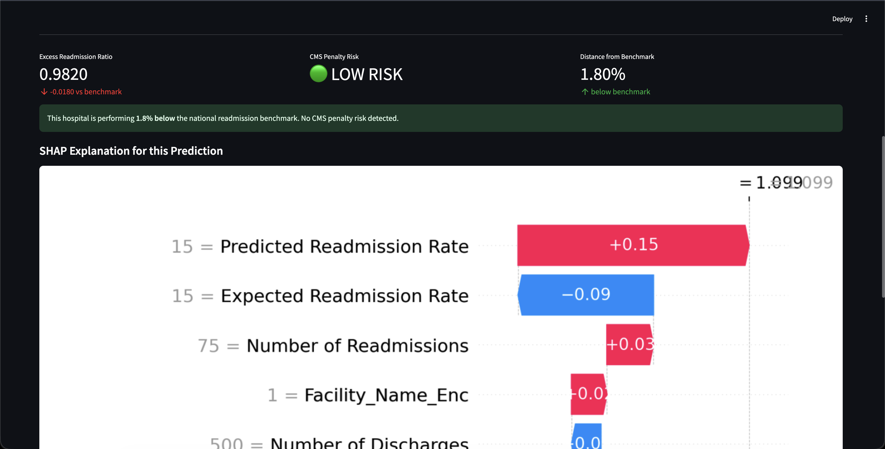

# Hospital Readmission Risk Predictor

Predicting **Excess Readmission Ratios** for US hospitals using the FY2024 CMS Hospital Readmissions Reduction Program (HRRP) dataset. Hospitals with a ratio above 1.0 face CMS financial penalties. This system predicts which hospitals are at risk, quantifies how far they are from the benchmark, and explains the prediction at the feature level using SHAP.

[](https://your-app-url.streamlit.app)
[](https://python.org)
[](https://xgboost.readthedocs.io)
[](LICENSE)



## Live Demo

[Hospital Readmission Risk Predictor on Streamlit](https://your-app-url.streamlit.app)

Enter hospital metrics, get a predicted Excess Readmission Ratio, and see a per-prediction SHAP waterfall chart explaining which features drove the result.

## Problem Statement

Under the CMS HRRP, hospitals are penalized for excess readmissions across six conditions: AMI, CABG, COPD, Heart Failure, Hip/Knee Replacement, and Pneumonia. The Excess Readmission Ratio (ERR) compares a hospital's actual readmission rate to the national risk-adjusted benchmark. An ERR above 1.0 triggers financial penalties. Early identification of at-risk hospitals enables targeted intervention before penalties are applied.

## Architecture
```
CMS FY2024 HRRP Dataset (CSV)
    ↓
src/preprocess.py
    ├── KNN Imputation (missing clinical values)
    ├── Target Encoding (Facility Name — high cardinality)
    ├── Label Encoding (State)
    └── One-Hot Encoding (Measure Name — 6 conditions)
    ↓
src/train.py
    ├── Train/Test Split (80/20, random_state=42)
    ├── StandardScaler
    ├── XGBRegressor (n_estimators=200, lr=0.05, max_depth=6)
    └── 5-Fold Cross Validation
    ↓
src/evaluate.py
    ├── SHAP TreeExplainer
    ├── Summary Plot + Bar Plot (saved to assets/)
    ├── Feature Importance CSV
    └── Binary Classification Metrics (threshold ERR=1.0)
    ↓
models/xgboost_model.pkl + models/scaler.pkl
    ↓
app/streamlit_app.py
    ├── Tab 1: Predict — form input → scaled → model → ERR + SHAP waterfall
    ├── Tab 2: Model Performance — metrics + SHAP summary plot
    └── Tab 3: Feature Importance — ranked SHAP table + bar chart
```

## Tech Stack

| Layer | Technology |
|---|---|
| ML Model | XGBoost 2.1.4 (XGBRegressor) |
| Explainability | SHAP (TreeExplainer, waterfall, summary, bar plots) |
| Preprocessing | scikit-learn (KNNImputer, StandardScaler, LabelEncoder) |
| Feature Encoding | category-encoders (TargetEncoder for high-cardinality features) |
| Data | pandas, numpy |
| Dashboard | Streamlit 1.44 |
| Visualization | Matplotlib, Plotly |
| Serialization | joblib |
| Language | Python 3.13 |

## Model Results

| Metric | Value |
|---|---|
| R² Score | 0.9480 |
| CV R² Mean (5-fold) | 0.9378 |
| CV R² Std | ±0.0031 |
| MSE | 0.00019 |
| Precision (ERR > 1.0) | 0.9773 |
| Recall (ERR > 1.0) | 0.9663 |
| F1 Score (ERR > 1.0) | 0.9718 |

Cross-validation std of ±0.0031 across 5 folds confirms the model is not overfit to the test split and generalizes consistently across data partitions.

## Key Features by SHAP Importance

1. **Expected Readmission Rate** — national risk-adjusted benchmark for the condition
2. **Predicted Readmission Rate** — hospital-specific predicted rate based on patient mix
3. **Number of Discharges** — hospital volume proxy, correlates with case complexity
4. **Number of Readmissions** — observed readmission count for the measure period
5. **Facility Name (encoded)** — target-encoded hospital identity signal
6. **Condition Measure** — one-hot flags for AMI, COPD, HF, Hip/Knee, Pneumonia, CABG

## Project Structure
```
Hospital-Readmission-Prediction/
├── app/
│   └── streamlit_app.py          # Streamlit dashboard (3 tabs)
├── src/
│   ├── preprocess.py             # KNN imputation, encoding pipeline
│   ├── train.py                  # XGBoost training, CV, scaler
│   ├── evaluate.py               # SHAP analysis, binary metrics
│   └── pipeline.py               # End-to-end runner
├── data/
│   └── cleaned_hospital_readmissions.csv
├── models/
│   ├── xgboost_model.pkl
│   └── scaler.pkl
├── assets/
│   ├── shap_summary.png
│   ├── shap_bar.png
│   ├── feature_importance.csv
│   └── metrics.json
├── .streamlit/
│   └── config.toml
├── requirements.txt
└── README.md
```

## How to Run Locally

**Clone the repo**
```bash
git clone https://github.com/hrithikda/Hospital-Readmission-Prediction.git
cd Hospital-Readmission-Prediction
```

**Set up the environment**
```bash
python3 -m venv venv
source venv/bin/activate
pip install -r requirements.txt
```

**Run the full pipeline (retrain model + regenerate SHAP plots)**
```bash
python src/pipeline.py
```

**Launch the Streamlit app**
```bash
python -m streamlit run app/streamlit_app.py
```

## Model Limitations

The top SHAP features (Expected Readmission Rate, Predicted Readmission Rate) are derived from the same CMS formula as the target variable (ERR). The model is highly accurate at replicating the CMS ratio calculation but operates within the same feature space as the regulatory formula. It is best interpreted as a **regulatory risk classifier** for flagging penalty-at-risk hospitals, not as an independent clinical predictor of patient outcomes.

## Dataset

**FY2024 CMS Hospital Readmissions Reduction Program** — publicly available from the Centers for Medicare and Medicaid Services. 18,774 hospital-condition records across 6 readmission measures tracked under HRRP.

## Author

**Hrithik Dasharatha Angadi**
[GitHub](https://github.com/hrithikda) — [LinkedIn](https://linkedin.com/in/hrithikda) — hrithikda@gmail.com